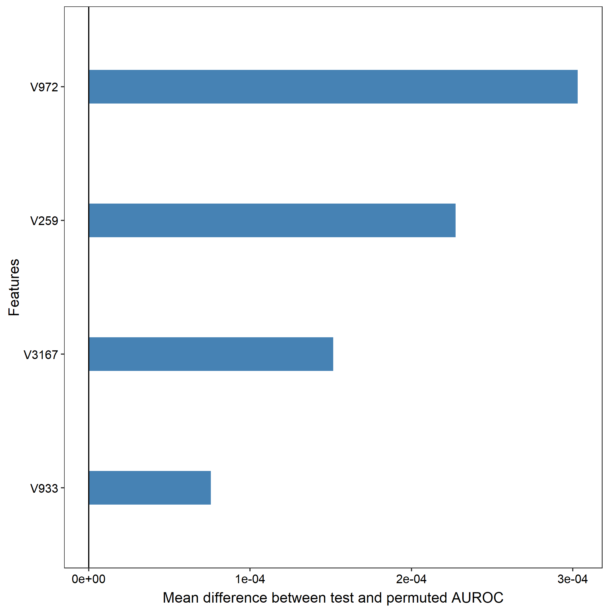

# Results

### 1.11.2022
"lyme_data.csv", which includes all samples used by Dorde.
Logistic regression
Stratified five-fold cross validation repeated 100 times.
Training fraction = 0.8
Alpha = 0
Lambda = 0.04
Seed = 2019

Results (.csv) in feature_importance_01112022

Four important features (V972, V259, V3167, V933) were found.

